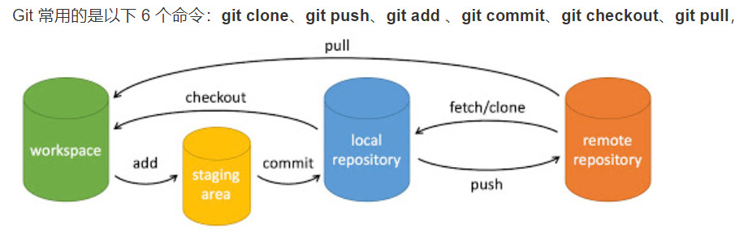

#

1 git init
2 git remote add name + ssh 关联远程仓库，在本地新建一个分支仓库，name是本地仓库名字，例如origin
3 git pull origin main:<本地仓库（可省略）>  从远程仓库拉取然后和本地仓库合并，可省略本地仓库名字
4 git add "文件名" 往暂存区加文件
5 git commit -m +"注释" 把文件提交到仓库 -m是注释
6 git push -u origin master:main #origin:远程仓库名字; master:本地分支 main 远程分支
7 git status 查看状态
8 git checkout -b name  #name为分支名称  新建本地分支
9 git branch 查看本地分支，带星号表明正在操作
10 git branch -a 查看所有分支
